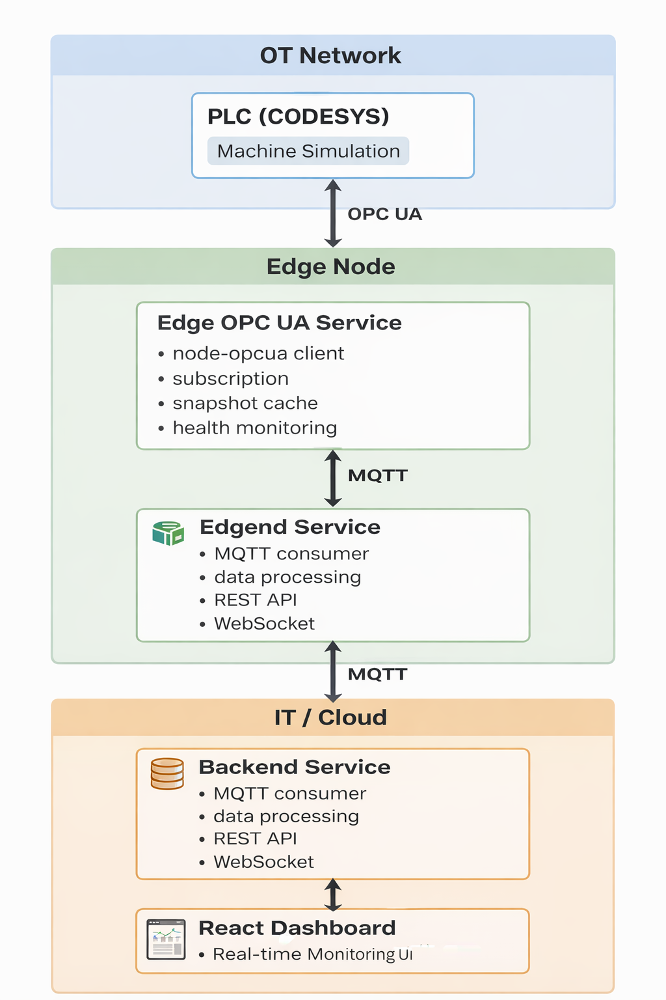

# Edge OPC UA Service (Industrial Edge Data Collector)

## Overview

The **Edge OPC UA Service** is a data acquisition service designed for
**Industrial Edge monitoring platforms**.

It connects to industrial controllers via **OPC UA**, subscribes to machine
telemetry, and collects real-time operational data.

The service acts as the **Edge layer bridging OT (Operational Technology) and IT
systems** in an Industrial IoT architecture

---

## System Architecture



The Edge Service operates between industrial equipment and backend systems.

```
PLC (CODESYS SoftPLC)
        │
        │ OPC UA
        ▼
Edge OPC UA Service
        │
        │ MQTT (next stage)
        ▼
Backend Service
        │
        ▼
PostgreSQL
        │
        ▼
React Monitoring Dashboard
```

Responsibilities of the Edge Service:

- Connect to PLC OPC UA server
- Subscribe to industrial telemetry
- Maintain latest machine snapshot
- Monitor data quality
- Provide health monitoring
- Automatically recover from connection failures

---

## Features

- 🔌 **OPC UA Protocol Support** Standard OPC UA industrial communication
  protocol.

  🔐 **Secure Connections** Supports multiple OPC UA security modes and
  policies.

  📊 **Real-time Data Monitoring** Subscribes to industrial telemetry such as
  temperature and vibration.

  🔄 **Automatic Reconnection** Intelligent backoff and rebuild strategy.

  🏥 **Health Monitoring** Built-in service health reporting.

  📝 **Structured Logging** Structured logs using **Pino**.

  ⚡ **High Performance** Implemented in **TypeScript** with event-driven
  architecture.

---

## Technology Stack

| Component     | Technology        |
| ------------- | ----------------- |
| Runtime       | Node.js           |
| Language      | TypeScript        |
| OPC UA Client | node-opcua-client |
| Logging       | Pino              |
| Configuration | dotenv            |

---

## Monitored Machine Data

The service subscribes to four industrial telemetry variables:

```
MachineData.Temperature
MachineData.Vibration
MachineData.Status
MachineData.Error
```

Example snapshot:

```
{
  "Temperature": { "value": 25.5 },
  "Vibration": { "value": 1.2 },
  "Status": { "value": 2 },
  "Error": { "value": false }
}
```

These values originate from the **PLC simulation**.

---

## Quick Start

### Install Dependencies

```bash
npm install
```

### Configure Environment Variables

Copy the `.env.example` file and modify it according to your OPC UA server
configuration:

```bash
cp .env.example .env
```

### Run in Development Mode

```bash
npm run dev
```

Or with pretty-formatted logs:

```bash
npm run dev:pretty
```

### Build and Run for Production

```bash
npm run build
npm start
```

## Configuration

| Variable                | Description                               | Default        |
| ----------------------- | ----------------------------------------- | -------------- |
| `OPCUA_ENDPOINT`        | OPC UA server endpoint address            | -              |
| `OPCUA_USERNAME`        | Username                                  | -              |
| `OPCUA_PASSWORD`        | Password                                  | -              |
| `OPCUA_SECURITY_MODE`   | Security mode (None/Sign/SignAndEncrypt)  | SignAndEncrypt |
| `OPCUA_SECURITY_POLICY` | Security policy                           | Basic256Sha256 |
| `NODEID_TEMPERATURE`    | Temperature node ID                       | -              |
| `NODEID_VIBRATION`      | Vibration node ID                         | -              |
| `NODEID_STATUS`         | Status node ID                            | -              |
| `NODEID_ERROR`          | Error node ID                             | -              |
| `LOG_LEVEL`             | Log level                                 | info           |
| `PUBLISH_INTERVAL_MS`   | Publishing interval (milliseconds)        | 500            |
| `SAMPLING_INTERVAL_MS`  | Sampling interval (milliseconds)          | 200            |
| `SUB_QUEUE_SIZE`        | Subscription queue size                   | 10             |
| `EMIT_INTERVAL_MS`      | Data output interval (milliseconds)       | 3000           |
| `RECONNECT_BASE_MS`     | Reconnection base delay (milliseconds)    | 2000           |
| `RECONNECT_MAX_MS`      | Reconnection maximum delay (milliseconds) | 30000          |

---

## Architecture

### Core Components

| Component        | Description                      |
| ---------------- | -------------------------------- |
| OpcuaEdgeService | Main OPC UA client service       |
| HealthReporter   | Service health monitoring        |
| Logger           | Structured logging               |
| Config           | Central configuration management |

---

### Connection Lifecycle

The service follows this connection pipeline:

```
connect
   ↓
createSession
   ↓
createSubscription
   ↓
monitorItems
   ↓
receive data change events
```

---

### Reconnection Strategy

Industrial networks may experience instability.

The service includes a **rebuild mechanism**.

When connection issues occur:

```
connection lost
      ↓
backoff retry
      ↓
schedule rebuild
      ↓
teardown old resources
      ↓
rebuild OPC UA pipeline
```

The pipeline rebuild process ensures monitoring is restored automatically.

---

### Snapshot Model

The service maintains a **latest machine snapshot in memory**.

Example structure:

```
{
  "Temperature": {
    "value": 25.5,
    "sourceTimestamp": "...",
    "statusCode": "Good"
  }
}
```

Snapshots are emitted periodically based on configuration.

---

### Data Quality Monitoring

Each monitored variable includes a quality state:

```
Good
Bad
Unknown
```

If the OPC UA server reports bad quality:

- `badCount` increases
- a warning log is generated
- the snapshot marks the variable as `Bad`

---

### Health Monitoring

The service periodically reports its health status.

Example health report:

```
{
  opcua: {
      "connected": true,
      "hasSession": true,
      "hasSubscription": true,
      "badCount": 0,
      "subscriptionId": 1,
      "lastDataTs": "2026-03-06T10:55:31.944Z"
      "subscriptionId": 1,
      "lastDataTs": "2026-03-06T10:55:31.944Z"
    }
}
```

This helps identify communication issues.

---

## Project Structure

```
edge-service
├ src
  ├ config
  │   └ index.ts
  ├ errors
  │   └ AppError.ts
  ├ logger
  │   └ index.ts
  ├ services
  │   ├ health
  │   │   └ HealthReporter.ts
  │   └ opcua
  │       ├ OpcuaEdgeService.ts
  │       └ types.ts
  ├ types
  │   ├ index.ts
  │   └ machine.ts
  └ app.ts
├ package.json
├ tsconfig.json
└ .env
```

---

## Log Output Example

Structured logs generated by the service:

```
[11:55:33.351] INFO: machine snapshot
    service: "edge-opcua"
    ts: "2026-03-06T10:55:33.351Z"
    data: {
      "Temperature": {
        "value": 29.25585174560547,
        "sourceTimestamp": "2026-03-06T10:55:31.438Z",
        "serverTimestemp": "2026-03-06T10:55:31.438Z",
        "statusCode": "Good (0x00000000)",
        "ageMs": 1912,
        "stale": false,
        "quality": "Good"
      },
      "Vibration": {
        "value": 0.11535000056028366,
        "sourceTimestamp": "2026-03-06T10:55:31.438Z",
        "serverTimestemp": "2026-03-06T10:55:31.438Z",
        "statusCode": "Good (0x00000000)",
        "ageMs": 1912,
        "stale": false,
        "quality": "Good"
      },
      "Status": {
        "value": 3,
        "sourceTimestamp": "2026-03-06T10:55:31.438Z",
        "serverTimestemp": "2026-03-06T10:55:31.438Z",
        "statusCode": "Good (0x00000000)",
        "ageMs": 1912,
        "stale": false,
        "quality": "Good"
      },
      "Error": {
        "value": true,
        "sourceTimestamp": "2026-03-06T10:55:31.438Z",
        "serverTimestemp": "2026-03-06T10:55:31.438Z",
        "statusCode": "Good (0x00000000)",
        "ageMs": 1912,
        "stale": false,
        "quality": "Good"
      }
    }
```

---

## Troubleshooting

Common issues:

### Connection failed

Check:

- OPC UA endpoint
- credentials
- network connectivity

---

### Node not found

Verify:

- namespace index
- node ID format

---

### Data not updating

Check:

- sampling interval
- subscription publishing interval

---

### Connection instability

Monitor:

- reconnect delay
- rebuild frequency

---

## Debugging Tips

Enable debug logs:

```
LOG_LEVEL=debug
```

Use pretty log output:

```
npm run dev:pretty
```

---

## OPC UA Server Setup

Ensure the PLC OPC UA server is properly configured.

See official documentation:

[https://content.helpme-codesys.com/en/CODESYS%20Communication/_cds_runtime_opc_ua_server.html](https://content.helpme-codesys.com/en/CODESYS
Communication/\_cds_runtime_opc_ua_server.html?utm_source=chatgpt.com)

---

## Future Improvements

Planned enhancements:

- MQTT publishing
- edge buffering
- edge analytics
- Docker container deployment
- multi-machine monitoring support

---

## Author

Yan Yang
